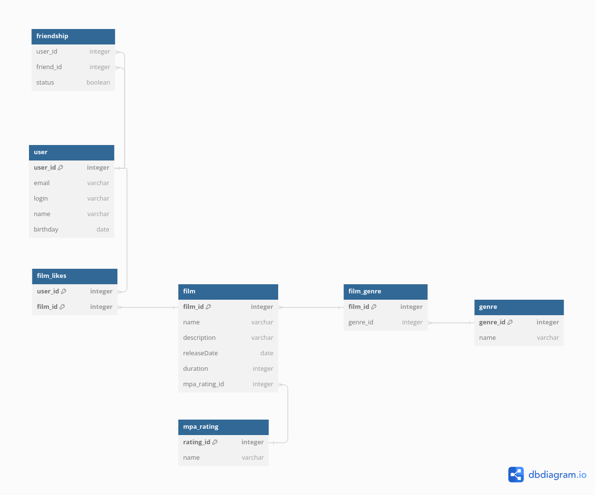

# java-filmorate
Template repository for Filmorate project.

Схема данных

Скрипт создания схемы:

CREATE TABLE "film" (
"film_id" integer PRIMARY KEY,
"name" varchar,
"description" varchar,
"releaseDate" date,
"duration" integer,
"mpa_rating_id" integer
);

CREATE TABLE "mpa_rating" (
"rating_id" integer PRIMARY KEY,
"name" varchar
);

CREATE TABLE "film_likes" (
"user_id" integer,
"film_id" integer,
PRIMARY KEY ("user_id", "film_id")
);

CREATE TABLE "genre" (
"genre_id" integer PRIMARY KEY,
"name" varchar
);

CREATE TABLE "film_genre" (
"film_id" integer PRIMARY KEY,
"genre_id" integer
);

CREATE TABLE "user" (
"user_id" integer PRIMARY KEY,
"email" varchar,
"login" varchar,
"name" varchar,
"birthday" date
);

CREATE TABLE "friendship" (
"user_id" integer,
"friend_id" integer,
"status" boolean
);

ALTER TABLE "friendship" ADD FOREIGN KEY ("user_id") REFERENCES "user" ("user_id");

ALTER TABLE "film" ADD FOREIGN KEY ("mpa_rating_id") REFERENCES "mpa_rating" ("rating_id");

ALTER TABLE "film_likes" ADD FOREIGN KEY ("film_id") REFERENCES "film" ("film_id");

ALTER TABLE "film_likes" ADD FOREIGN KEY ("user_id") REFERENCES "user" ("user_id");

ALTER TABLE "film_genre" ADD FOREIGN KEY ("genre_id") REFERENCES "genre" ("genre_id");

ALTER TABLE "film" ADD FOREIGN KEY ("film_id") REFERENCES "film_genre" ("film_id");

ALTER TABLE "friendship" ADD FOREIGN KEY ("friend_id") REFERENCES "user" ("user_id");